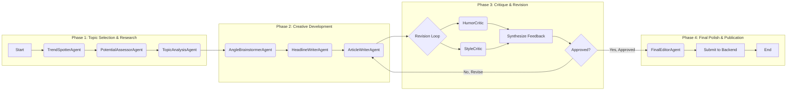
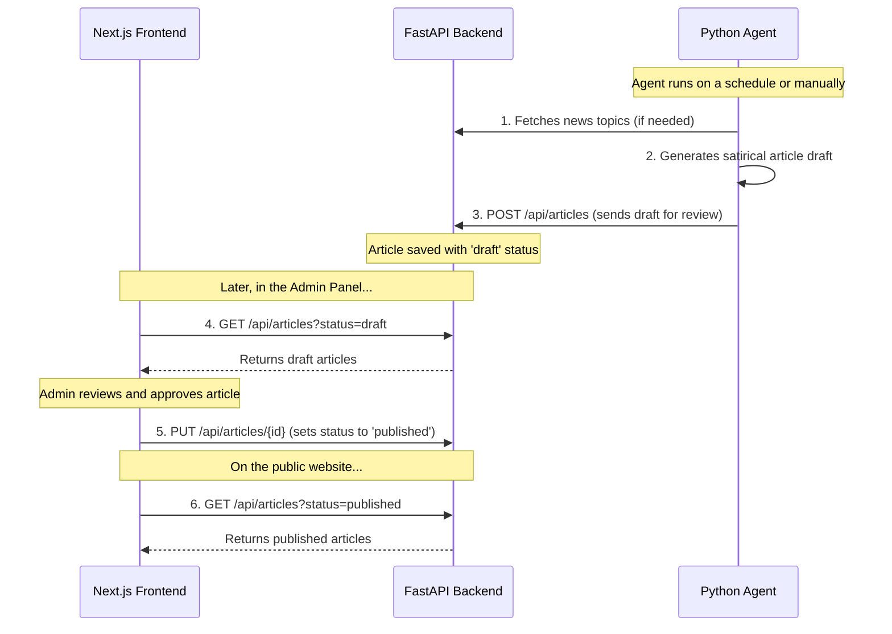

# The Absurd Chronicle: An Agentic News Platform


> A full-stack platform featuring an autonomous AI newsroom that generates, critiques, and publishes satirical content based on real-world events.

This project uses a sophisticated multi-agent system to mimic a real-world editorial workflow. A team of specialized AI agents collaborates to take a story from a basic idea to a fully written, edited, and categorized article, which is then served to a modern, interactive web frontend.

## Core Features

-   **Autonomous Content Pipeline**: The entire process, from finding a topic to writing and polishing the article, is handled automatically by the AI agent system.
-   **Multi-Agent Collaboration**: The system is built on a team of specialized agents, including:
    -   `TrendSpotterAgent`: Scans real-world news headlines from India using the NewsAPI.
    -   `TopicAnalysisAgent`: Provides a deeper summary of the news topic for context.
    * `AngleBrainstormerAgent`: Develops multiple creative satirical angles.
    -   `HeadlineWriterAgent`: Crafts a punchy headline for the chosen angle.
    -   `ArticleWriterAgent`: Writes the full, structured article.
-   **Iterative Multi-Critic Revision Loop**:
    -   Once a draft is written, it's reviewed by two specialist critics: a `HumorCriticAgent` and a `StyleCriticAgent`.
    -   The `Coordinator` agent synthesizes their feedback and sends the article back for revision. This loop ensures a high-quality final product.
-   **Final Polish and Categorization**:
    -   A `FinalEditorAgent` performs a final proofread, cleaning up any AI-generated conversational filler and making the article publishable.
    -   This final agent also categorizes the article (e.g., Sports, Tech, Business) before submission.
-   **Full-Stack Application**:
    -   A **FastAPI (Python)** backend serves the articles via a REST API.
    -   A **Next.js (React)** frontend provides a professional, responsive news website UI.
    -   Features dynamic pages for individual articles and category-based filtering.
-   **Responsible AI**: An automated disclaimer is appended to every article, clearly marking it as a work of satire.




## Tech Stack

| Frontend           | Backend            | AI & Agent Orchestration      |
| ------------------ | ------------------ | ----------------------------- |
| Next.js            | Python 3           | Groq API (Llama 3)            |
| React              | FastAPI            | NewsAPI                       |
| Tailwind CSS       | Uvicorn            | Python Classes |

## System Architecture

The project is divided into three core components that run independently:



## Setup and Installation

Follow these steps to get the project running locally.

### 1. Clone the Repository
```bash
git clone [https://github.com/YOUR_USERNAME/Agentic-Satire-Platform.git](https://github.com/YOUR_USERNAME/Agentic-Satire-Platform.git)
cd Agentic-Satire-Platform
```

### 2. Configure Environment Variables
This project requires API keys for Groq and NewsAPI.

-   Navigate to the `agent/` directory.
-   Create a new file named `.env`.
-   Add your keys to this file like so:
    ```
    GROQ_API_KEY="your-groq-api-key"
    NEWS_API_KEY="your-newsapi-key"
    ```

### 3. Setup Backend & Agent
The backend and agent share the same Python environment.

```bash
# Navigate to the agent directory
cd agent

# Create and activate a virtual environment (recommended)
python -m venv venv
source venv/bin/activate  # On Windows, use `venv\Scripts\activate`

# Install required Python packages
pip install -r requirements.txt
```
*(Repeat the `pip install` step in the `backend/` directory if it has its own `requirements.txt` file.)*

### 4. Setup Frontend

```bash
# Navigate to the frontend directory
cd ../frontend

# Install Node.js packages
npm install
```

## Running the Application

You will need to run each of the three components in a separate terminal.

**Terminal 1: Start the Backend**
```bash
cd backend
uvicorn main:app --reload
```
*Your backend API will be running on `http://127.0.0.1:8000`.*

**Terminal 2: Start the Frontend**
```bash
cd frontend
npm run dev
```
*Your news website will be running on `http://localhost:3000`.*

**Terminal 3: Run the AI Agent**
To generate a new article, run the agent script.
```bash
cd agent
python agent.py
```
*The agent will run, and upon completion, a new article will be available as a draft in the admin panel at `http://localhost:3000/admin`.*

## License
Distributed under the MIT License. See `LICENSE` for more information.
